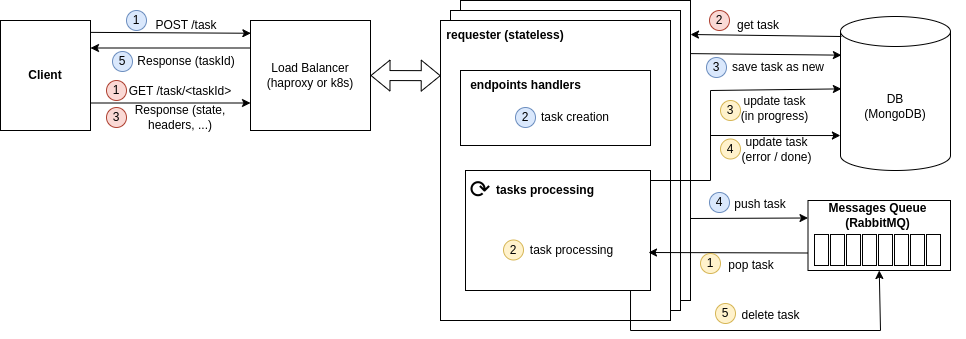

# requester

## Description

`requester` is a stateless microservice that handles sending HTTP requests to 3rd-party services using MongoDB and RabbitMQ.

The general scheme of interaction is shown in the diagram below:




**What is done (besides the main logic of the application):**
- Unit tests
- Validation of request data
- Graceful shutdown
- Healthchecks
- Used linters: golangci-lint, hadolint
- Created docker-compose configuration for running `requester` and all the necessary components
- `requester` config (env vars & command-line arguments)
- Used taskfile for building and testing the project

## Prerequisites

- golang (go1.20.12)
- docker (24.0.7)
- docker-compose (v2.15.0)
- taskfile (v3.22.0)
- mockery (v2.39.1)

## Run in Docker Compose

```bash
docker-compose up
docker-compose logs --follow requester

# cleanup
docker-compose down
docker rmi requester:dev
```

## REST API (curl requests)

The microservice exposes two endpoints:

<details>
<summary><code>POST /task</code></summary>

This endpoint accepts a JSON payload with the task details and returns a task ID.

**Successful case:**

```bash
curl -s -d '{"method":"GET", "url":"https://httpbin.org/delay/7", "headers": {"User-Agent": ["Bing"]}}' -H "Content-Type: application/json" -X POST http://localhost:8080/api/v1/task | jq
# Output:
{
  "id": "a79743e5-14cf-4406-b30e-2bfcb98556e7"
}
```

**Bad input:**

```bash
curl -s -d '{"method":"Invalid", "url":"https://httpbin.org/get", "headers": {"User-Agent": ["Bing"]}}' -H "Content-Type: application/json" -X POST http://localhost:8080/api/v1/task | jq
# Output
{
  "error": "couldn't decode request: request validation error\nvalidation error: method must be one of [GET HEAD POST PUT PATCH DELETE CONNECT OPTIONS TRACE]",
  "httpStatusCode": 400
}
```

</details>

<details>
<summary><code>GET /task/{taskId} </code></summary>

This endpoint returns the status and result of the task with the given ID.

```bash
curl -s -X GET http://localhost:8080/api/v1/task/66053ecb-84a8-4bc8-b1c8-2afb0e378d42 | jq

# Output (new task)
{
  "id": "66053ecb-84a8-4bc8-b1c8-2afb0e378d42",
  "status": "new",
}

# Output (task in progress)
{
  "id": "66053ecb-84a8-4bc8-b1c8-2afb0e378d42",
  "status": "in_progress",
}

# Output (task not found)
{
  "error": "couldn't get task result: couldn't get task result from repository: task not found\nmongo: no documents in result",
  "httpStatusCode": 404
}

# Output (task completed with error)
{
  "id": "66053ecb-84a8-4bc8-b1c8-2afb0e378d42",
  "status": "error",
  "error": "request execution failed\nGet \"https://httpbin.org/delay/12\": context deadline exceeded (Client.Timeout exceeded while awaiting headers)"
}


# Output (task completed successfully)
{
  "id": "430cf292-2f20-4935-a41b-6c5b0a97062a",
  "status": "done",
  "httpStatusCode": 200,
  "headers": {
    "Access-Control-Allow-Credentials": [
      "true"
    ],
    "Access-Control-Allow-Origin": [
      "*"
    ],
    "Content-Length": [
      "258"
    ],
    "Content-Type": [
      "application/json"
    ],
    "Date": [
      "Mon, 25 Dec 2023 07:33:19 GMT"
    ],
    "Server": [
      "gunicorn/19.9.0"
    ]
  },
  "length": 258,
  "body": "{\n  \"args\": {}, \n  \"headers\": {\n    \"Accept-Encoding\": \"gzip\", \n    \"Host\": \"httpbin.org\", \n    \"User-Agent\": \"Bing\", \n    \"X-Amzn-Trace-Id\": \"Root=1-6589303f-4d13f51506ad87cc67a1d7b7\"\n  }, \n  \"origin\": \"178.121.30.20\", \n  \"url\": \"https://httpbin.org/get\"\n}\n"
}
```

</details>
